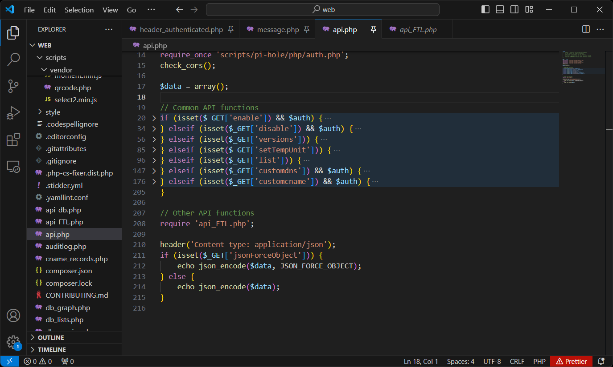
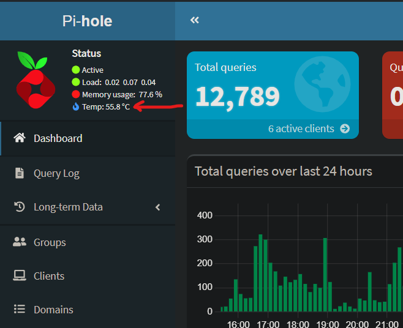

In my journey as a [bug bounty hunter,](https://hackerone.com/kiyell) one of the things that I do all the time is pentesting web applications without access to the source code. This is known as black-box testing. So when I recently purchased a Raspberry Pi and installed Pi-hole for use in my home network, I started thinking about testing for a change, a piece of open source software I'm using for security flaws.

[Pi-hole](https://pi-hole.net/) is basically an ad blocker that works by not resolving the domain names that advertisers use. Since it acts as a DNS server on a network, it blocks ads at a network level and thus improves network performance as well. It also includes a dashboard secured with a password that allows the monitoring and configuring of different settings. This dashboard which was implemented in PHP was the focus of my testing.

## Mapping the surface

I began by cloning the [GitHub repository](https://github.com/pi-hole/web) and opening it up in [Visual Studio Code](https://code.visualstudio.com/) which I like because of it' simplicity support of many languages. The first question I had about Pi-hole was how are security controls implemented to control access to the dashboard and the many settings pages? 

After browsing a few PHP files I came to the conclusion that access was controlled primarily by the file **header_authenticated.php** which other pages that needed to be protected would include with: 

`require 'scripts/pi-hole/php/header_authenticated.php';`

Looking at the source code of that file I could see that an important part of the authentication flow included the checking of the Boolean variable *$auth* that if false would trigger logic to exit out of the further execution of code intended for authenticated users. Having this understanding I then searched for all files with a PHP extension that did not include **header_authenticated.php** using grep.

```
❯ grep -rL 'header_authenticated.php' --include='*.php' .
./.php-cs-fixer.dist.php
./api.php
./api_db.php
./api_FTL.php
./login.php
./logout.php
./scripts/pi-hole/php/api_token.php
./scripts/pi-hole/php/auth.php
./scripts/pi-hole/php/customcname.php
./scripts/pi-hole/php/customdns.php
./scripts/pi-hole/php/database.php
./scripts/pi-hole/php/debug.php
./scripts/pi-hole/php/footer.php
./scripts/pi-hole/php/FTL.php
./scripts/pi-hole/php/func.php
./scripts/pi-hole/php/gravity.php
./scripts/pi-hole/php/gravity.sh.php
./scripts/pi-hole/php/groups.php
./scripts/pi-hole/php/header.php
./scripts/pi-hole/php/header_authenticated.php
./scripts/pi-hole/php/message.php
./scripts/pi-hole/php/network.php
./scripts/pi-hole/php/password.php
./scripts/pi-hole/php/persistentlogin_token.php
./scripts/pi-hole/php/queryads.php
./scripts/pi-hole/php/savesettings.php
./scripts/pi-hole/php/sidebar.php
./scripts/pi-hole/php/tailLog.php
./scripts/pi-hole/php/teleporter.php
./scripts/pi-hole/php/theme.php
./scripts/pi-hole/php/update_checker.php
./scripts/vendor/qrcode.php
```

[Grep](https://www.gnu.org/software/grep/manual/grep.html) is a command line tool for finding search patterns in the content of files. I used both the -r, -L, and --include arguments in order to specify that I wanted to search recursively through subfolders and I wanted to have returned to me files without a match that end in *.php*

Browsing the source code of these files I noticed that in the majority of cases no access control bypasses were possible because of a variety factors including:
* Code that checked the $auth variable before continuing execution
* A *token* POST parameter was checked to be matching a session token given after login
* The code was either UI elements or only functions for use in other protected endpoints

But one file that caught my eye and was partially unaffected by these factors was **api.php** which included code to modify several different settings using GET / POST parameters. This included the ability to enable/disable ad blocking and even execute a command on the system.

## A deep dive into the api.php file

The entire file was essentially a big if elseif statement. So beginning from the top, I traced the execution path and paid attention to any points in which an unauthenticated user would be able to execute system modifying code. VS Code's collapsible curly brackets feature made this easier in that I could quickly hide code I wasn't interested in.



With this collapsed view of the if / elseif statements, I turned my attention to the three HTTP GET parameters which when accessed with the **api.php** endpoint would execute code without checking the *$auth* variable. The first of these returned version information which is not ideal from a security perspective but also not the end of the world. The last contained a check of the *$auth* variable in the next line so it wasn't actually accessible anonymously. 

The most interesting of the elseif statements was the one that checked for the *setTempUnit* parameter. Looking at this part of the code in full I became quite excited:

```
…
} elseif (isset($_GET['setTempUnit'])) {
    $unit = strtolower($_GET['setTempUnit']);
    if ($unit == 'c' || $unit == 'f' || $unit == 'k') {
        pihole_execute('-a -'.$unit);
        $result = 'success';
    } else {
        // invalid unit
        $result = 'error';
    }
…
```

**An unprotected endpoint that executes a command on the system!** Is a remote execution exploit lying within? 

Unfortunately it appears not. The reason is that this code is actually well protected from anyone being able to do anything besides executing the specific command specified using one of three possible values. That's primarily because of the call to PHP's strtolower() and the enforcement of only accepting three predefined vaues. And what does this command do that can be activated by any unauthenticated user with a simple call to http://[pi-hole-server]/admin/api.php?setTempUnit=c (or f or k) ?

Change the CPU temperature format displayed on the status page to either Celsius, Fahrenheit, or Kelvin



## Reporting the issue to the Pi-hole team

Although the security flaw was quite inconsequential I felt that it still should be reported to the maintainers of this project. I also felt that a record should be made of such a flaw so that those use Pi-hole are aware of it. Perhaps even having a CVE issued which is basically a public notice of a security flaw in a piece of software. With that in mind I went to the GitHub repository for the project and [reported the issue](https://github.com/pi-hole/web/security) on July 13, 2024 using GitHub's report a vulnerability feature. 

Less than a day passes when I get a response from one of the maintainers. They tell me that they do not consider the bug a security issue and that the issue will be fixed in version 6. They also encourage me to make a pull request on the project if I would like to contribute to a fix in the current version. So I went ahead and added a check of the $auth variable to the code, created a pull request, and [my changes were accepted and merged](https://github.com/pi-hole/web/pull/3077) into the developmental branch of version 5.21.

*08/19/2024 Update: The MITRE Corporation CNA has created an official CVE for this vulnerability tracking it as [CVE-2024-44069](https://cve.mitre.org/cgi-bin/cvename.cgi?name=2024-44069). For now it is flagged as disputed due to the maintainers view of the issue.*

## Takeaways

Doing a security audit of a web application of which you have access to the source code is much easier than the black-box testing scenario I am more familiar with. There's much less friction involved when you can see and directly test the security logic without the cumbersome fuzzing/poking around process you often do when bug bounty hunting. 

Seeing and testing the code also left me with much respect for the maintainers of the Pi-hole project who have been able to build such a useful piece of software despite being a small team of volunteers with limited resources.

Although it was slightly disappointing that I did not find a security issue with bigger impact, this experience did continue to ignite in me a passion for source code review which led me to finding a bigger issue in another open source project. I hope to write about that experience soon.


